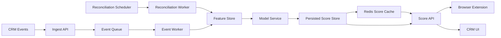
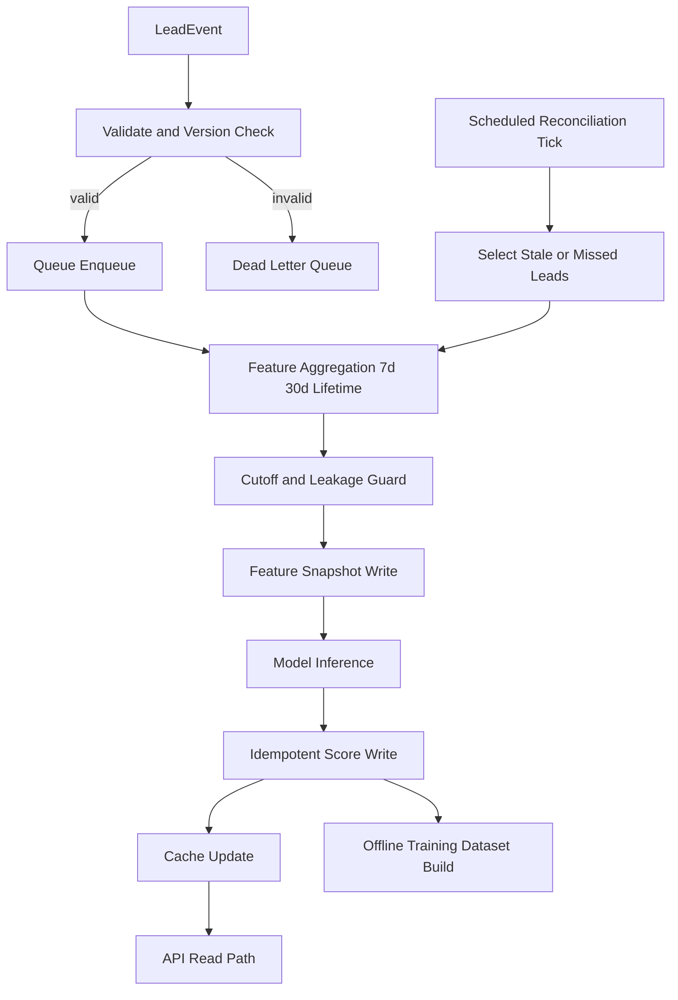

# Implementation Plan: Lead Intelligence Scoring Platform

**Branch**: `001-lead-scoring-platform` | **Date**: 2026-04-23 | **Spec**: `specs/001-lead-scoring-platform/spec.md`  
**Input**: Feature specification from `specs/001-lead-scoring-platform/spec.md`

## Summary

Deliver a multi-tenant lead-intent scoring service that classifies open leads as Hot/Warm/Cold, refreshes scores via hybrid event-driven plus reconciliation flows, and provides on-demand explanations with strict leakage and privacy controls. Implement a web-service-first architecture with canonical feature snapshots, persisted score source-of-truth, cache-assisted read path, tenant governance controls, and model lifecycle support (validation, versioning, rollback, drift-triggered retraining).

## Technical Context

**Language/Version**: Python 3.11  
**Primary Dependencies**: FastAPI, Pydantic, XGBoost, Pandas/Polars, SQLAlchemy, Redis client, Celery (or APScheduler/cron for reconciliation), OpenTelemetry SDK  
**Storage**: PostgreSQL (system of record), Redis (read-through cache), object storage for model artifacts  
**Testing**: pytest, contract tests (OpenAPI validation), integration tests for scoring pipeline and tenant isolation  
**Target Platform**: Linux server workloads (containerized)  
**Project Type**: backend web service + asynchronous pipeline workers  
**Performance Goals**: cache-path score API p99 <= 500 ms; >= 95% score updates persisted within 5 seconds for eligible events  
**Constraints**: strict cutoff enforcement; zero cross-tenant leakage; no direct PII in model features; explanation only on explicit request  
**Scale/Scope**: initial 100k+ leads across 3-4 tenants, designed for 10x growth

## End-to-End Scoring Flow

`LeadEvent -> Queue -> Worker -> feature_store snapshot update -> model_service score compute -> persisted LeadScore -> Redis cache -> API read (cache first, DB fallback)`

Trigger model:
- Event-driven: eligible lead events enqueue incremental recomputation.
- Scheduled reconciliation: periodic scheduler revalidates and recomputes stale/missed leads.

### System Architecture Diagram



### Data Flow Diagram



## Core Schemas (Planning View)

### LeadScore
- `tenant_id` (string, required)
- `lead_id` (string, required)
- `score_probability` (float [0,1], required)
- `score_category` (enum: cold, warm, hot, required)
- `model_version` (string, required)
- `feature_cutoff_ts` (timestamp, required)
- `score_ts` (timestamp, required)
- `is_stale` (boolean, required)
- `staleness_seconds` (integer, required)
- idempotency key: `(tenant_id, lead_id, feature_cutoff_ts, model_version)` (unique)

### LeadFeatureSnapshot
- `tenant_id` (string, required)
- `lead_id` (string, required)
- `feature_cutoff_ts` (timestamp, required)
- `feature_schema_version` (string, required)
- `feature_vector` (object, required)
- `is_leakage_validated` (boolean, required)

Example `feature_vector`:
```json
{
  "email_open_7d": 3,
  "click_rate_30d": 0.12,
  "days_since_last_activity": 5
}
```

### TenantScoringPolicy
- `tenant_id` (string, required)
- `scoring_enabled` (boolean, required)
- `threshold_cold_max` (float, required)
- `threshold_hot_min` (float, required)
- `override_enabled` (boolean, required)
- `policy_version` (string, required)

### LeadEvent (Queue Contract)
```json
{
  "event_id": "uuid",
  "event_version": 1,
  "tenant_id": "tenant_123",
  "lead_id": "lead_456",
  "event_type": "email_open",
  "event_ts": "2026-04-23T12:30:00Z",
  "payload": {}
}
```

Validation and bad-event handling:
- Reject events missing required fields or invalid tenant scope.
- Dead-letter invalid/unsupported events with reason code.
- Preserve idempotency via `event_id`.
- Support schema evolution through `event_version`.

## Constitution Check

*GATE: Must pass before Phase 0 research. Re-check after Phase 1 design.*

The constitution file is currently a placeholder template and defines no enforceable project principles yet.  
Gate result:
- No explicit constitutional blockers detected.
- Planning proceeds with spec-defined guardrails (tenant isolation, privacy, leakage controls, measurable SLAs).

Post-design re-check:
- Design artifacts align with current spec constraints.
- No constitutional violations can be evaluated until constitution is finalized.

## Project Structure

### Documentation (this feature)

```text
specs/001-lead-scoring-platform/
├── plan.md
├── research.md
├── data-model.md
├── quickstart.md
├── contracts/
│   └── scoring-api.yaml
└── tasks.md
```

### Source Code (repository root)

```text
backend/
├── src/
│   ├── api/
│   ├── feature_store/
│   │   ├── definitions/
│   │   ├── aggregations/
│   │   ├── offline_store/
│   │   └── online_store/
│   ├── models/
│   ├── services/
│   │   └── model_service.py
│   ├── pipelines/
│   │   └── scoring_flow.py
│   ├── training/
│   ├── workers/
│   │   ├── event_worker.py
│   │   └── scheduler.py
│   └── observability/
├── config/
│   ├── dev.yaml
│   └── prod.yaml
└── tests/
    ├── contract/
    ├── integration/
    └── unit/

extension/
├── src/
│   ├── content/
│   ├── popup/
│   └── services/
└── tests/
```

**Structure Decision**: Use a backend-centric service and worker architecture with a browser-extension client integration layer. This supports the clarified hybrid scoring strategy, strict data controls, and separation of scoring computation from score consumption.

### Layer Responsibilities
- `feature_store/`: canonical snapshots keyed by `(tenant_id, lead_id, feature_cutoff_ts)` for scoring and training data generation.
- `training/`: dataset extraction, feature generation, model training, AUC evaluation, artifact persistence to object storage.
- `services/model_service.py`: model loading, inference, and category mapping.
- `workers/scheduler.py`: periodic reconciliation and stale-score refresh orchestration.
- Queue transport: Redis-backed queue initially; Kafka-compatible abstraction reserved for future scale.
- Extension read path: `extension -> scoring API -> Redis cache -> persisted score fallback`.

### Feature Store Build Strategy
- Build modes:
  - Streaming/incremental updates on eligible lead events for online freshness.
  - Batch recomputation for reconciliation and backfill windows.
- Aggregation windows (initial baseline):
  - `7d` behavior features
  - `30d` behavior features
  - `lifetime` aggregates
- Backfill policy:
  - Historical feature rebuild jobs run by date range and tenant scope.
  - Rebuild output writes both offline feature snapshots and optional online warm cache.
- Training rebuild policy:
  - Training datasets are generated from offline snapshots only, never from live API reads.
- Online/offline consistency guarantee:
  - shared transformation code in `feature_store/definitions` and `feature_store/aggregations`
  - same feature definition metadata (names, windows, null handling) used by both paths
  - parity tests compare offline/online feature outputs for sampled `(tenant_id, lead_id, cutoff)` tuples
- Storage/query performance strategy:
  - core indexes:
    - `(tenant_id, lead_id)` on lead and score tables
    - `(tenant_id, score_ts DESC)` for latest-score reads
    - `(tenant_id, feature_cutoff_ts DESC)` for snapshot retrieval
  - worker/reconciliation indexes:
    - `(tenant_id, is_stale, score_ts)` for stale refresh scans
    - `(tenant_id, event_ts)` for event replay/backfill windows
  - partitioning:
    - range partition by time (`score_ts` / `feature_cutoff_ts`) with tenant-aware access predicates

### Explainability Strategy
- Base method: SHAP TreeExplainer for XGBoost probabilities.
- Output contract:
  - top positive and negative feature contributions
  - concise rationale summary
  - recommended next action
- Latency/cost controls:
  - explanation computed only on explicit request
  - explanation cache stored separately from score cache
  - cached explanation reused only if lead score context unchanged

### Threshold Governance
Authoritative threshold policy is defined in `spec.md` (`FR-021` and related clarifications); this section defines runtime application behavior.
- Default global thresholds:
  - `hot >= 0.80`
  - `warm 0.40-<0.80`
  - `cold < 0.40`
- Tenant overrides:
  - stored in tenant policy table
  - applied at scoring-read categorization stage
  - editable through admin policy API without redeploy
- Change controls:
  - threshold change events audited with author and timestamp
  - A/B tuning restricted to governed experiment scopes

### Drift and Retraining Controls
- Drift detection methods:
  - PSI for numeric feature drift
  - KL divergence for categorical distribution drift
  - prediction distribution drift monitors
- Retrain policy:
  - monthly scheduled retraining baseline
  - early retrain when drift thresholds breached
- Validation gates (before promotion):
  - minimum AUC gate vs current production model
  - non-regression checks on precision/recall and tenant fairness slices
  - rollback readiness to last approved model artifact

### Failure Modes and Fallbacks
- Redis unavailable:
  - API bypasses cache and reads persisted score from DB.
- Model load/inference failure:
  - return last known persisted score with stale indicator; enqueue recovery recompute.
- Queue backlog spike:
  - prioritize hot leads and recently active leads, apply worker autoscaling, and surface degraded freshness metric.
- Feature snapshot unavailable:
  - hold live recomputation, return last persisted score, and flag feature-store incident.
- Explanation failure:
  - return deterministic fallback guidance and avoid blocking score retrieval.
- Duplicate score write attempts:
  - enforce idempotency key uniqueness and upsert-safe persistence behavior.

### Observability and Alerting
- Core metrics:
  - scoring latency: p50/p95/p99
  - queue lag and queue depth
  - feature freshness lag (`now - feature_cutoff_ts`)
  - score freshness lag (`now - score_ts`)
  - drift metrics (PSI/KL)
  - per-tenant error rate and timeout rate
- Alerts (initial thresholds):
  - score API p95 latency > 400 ms for 10 minutes
  - queue lag > 120 seconds for 10 minutes
  - score freshness SLA breach rate > 5% in rolling 15 minutes
  - per-tenant error rate > 2% in rolling 10 minutes
- Tracing:
  - distributed trace spans from API/worker ingest through feature build, model inference, persistence, and cache write
  - trace attributes must include `tenant_id` (hashed/anonymized where required), `lead_id`, and `model_version`
- SLA enforcement actions:
  - if latency or freshness SLA breaches persist for configured windows, trigger autoscaling and priority-recompute mode
  - if breach remains unresolved, activate controlled degradation for non-critical explanation workloads
  - always emit incident alerts with tenant impact summary

### Multi-Tenant Security Enforcement
- API auth model:
  - authenticated service/API token includes tenant scope claims
  - all API routes require tenant context from auth + header consistency checks
- Query enforcement:
  - every read/write query must include `tenant_id` predicate
  - repository/service layer rejects tenant-agnostic access patterns
- Data isolation controls:
  - row-level security or equivalent policy guard on core score/feature tables
  - tenant-scoped cache keys and queue partitions
- Auditability:
  - log tenant access decisions and policy changes
  - periodic access-control verification tests in integration suite

### API Consumer Examples
Score response example:
```json
{
  "lead_id": "lead_456",
  "score_probability": 0.82,
  "score_category": "hot",
  "is_stale": false,
  "staleness_seconds": 0,
  "model_version": "v3.2",
  "score_ts": "2026-04-23T12:31:00Z"
}
```

### Cold-Start Strategy
- New lead with no usable interaction signals:
  - compute baseline probability from global priors
  - map to conservative default category (typically `cold`) unless tenant policy specifies `unknown` presentation
- Transition out of cold-start:
  - recompute immediately once minimum signal threshold is met
  - persist score with cold-start flag cleared

### Rate Limiting and Abuse Protection
- Per-tenant request controls:
  - score-read endpoints: token bucket with sustained RPS + burst cap per tenant
  - explanation endpoint: stricter quota due to SHAP cost (e.g., per-minute cap per tenant and per user)
- Load-shedding behavior:
  - when limit exceeded, return throttling response and retry hint
  - protect explanation workers before score-read path to preserve core UX
- Cost controls:
  - explanation cache lookup before compute
  - deduplicate concurrent explanation requests for same `(tenant_id, lead_id, score_ts)`
  - track per-tenant compute units for scoring and explanations
  - apply budget-aware throttling to explanation and non-critical recompute paths

### Data Retention and Archival
Authoritative retention requirements are defined in `spec.md` (`FR-034` and `SC-014`); this section defines initial operational windows.
- Retention windows (initial policy baseline):
  - raw events: 13 months hot storage, then archival
  - feature snapshots: 180 days online, then archive/offline store
  - persisted scores: 24 months active retention for reporting continuity
  - explanation payload cache: short TTL (minutes to hours), no long-term retention
- Policy controls:
  - retention jobs are scheduled and auditable
  - legal/compliance hold flags override deletion for scoped records

### Rollout Strategy
- New model rollout stages:
  - Stage 1: shadow scoring (no user impact), compare against active model
  - Stage 2: canary tenants (small tenant subset)
  - Stage 3: progressive tenant ramp (e.g., 10% -> 25% -> 50% -> 100%)
  - Stage 4: full rollout with active monitoring
- Promotion criteria:
  - meets validation gates and no severe canary regressions
  - no tenant isolation or privacy violations
- Rollback:
  - immediate switch to last approved `model_version` on regression trigger

### Model Upgrade Backfill Strategy
- Backfill trigger:
  - after a new model version is promoted for tenant scope, enqueue historical re-score jobs for configured lookback windows.
- Backfill execution:
  - process by tenant batches with idempotent writes keyed by `(tenant_id, lead_id, feature_cutoff_ts, model_version)`.
  - persist new score rows with upgraded `model_version` while retaining previous-version records for lineage and audit.
- Backfill safety controls:
  - throttle backfill to protect live scoring SLA.
  - pause/resume controls and per-tenant progress checkpoints.
  - integrity checks verify no cross-tenant writes and no lineage gaps.

### Chaos Testing Program
- Mandatory scenarios:
  - Redis unavailable (cache bypass behavior)
  - queue lag spike/backlog surge (priority recompute behavior)
  - model service degradation/failure (persisted-score fallback behavior)
- Execution model:
  - scheduled non-production drills plus controlled production-safe game days.
  - each run captures expected fallback outcomes, latency impact, and recovery time.
- Exit criteria:
  - unresolved critical fallback failures block release progression.

### Feature Registry Governance
- Registry model:
  - feature definitions tracked with `feature_schema_version`, owner, status, and compatibility metadata.
- Human workflow:
  - propose schema update -> review/approval -> compatibility test -> staged activation.
- Compatibility policy:
  - every schema change must pass online scoring compatibility and offline training parity checks.
- Tooling direction:
  - provide operator-facing registry management surface (CLI or internal UI) for version history and rollout state.

## Phase 2 Platform Enhancements (Optional)

- Self-serve feature registry UI:
  - role-based UI for feature version lifecycle, compatibility status, and rollout controls.
- Automated experiment platform:
  - experiment templates for thresholds/model variants, guarded enrollment, and auto-generated evaluation reports.
- Cost intelligence dashboards:
  - per-tenant compute and explanation spend telemetry, budget policy views, and anomaly alerts.

## Phase 0: Research Outcomes

Research decisions are documented in `specs/001-lead-scoring-platform/research.md` and resolve technical choices for cutoff enforcement, tenant modeling, threshold governance, stale-score behavior, retraining strategy, and privacy controls.

## Phase 1: Design Outputs

- Data model authored in `specs/001-lead-scoring-platform/data-model.md`
- API contract authored in `specs/001-lead-scoring-platform/contracts/scoring-api.yaml`
- Quickstart for delivery and validation authored in `specs/001-lead-scoring-platform/quickstart.md`
- Agent context updated in `.cursor/rules/specify-rules.mdc` to reference this plan

## Complexity Tracking

No constitution-based exemptions required at this stage.
