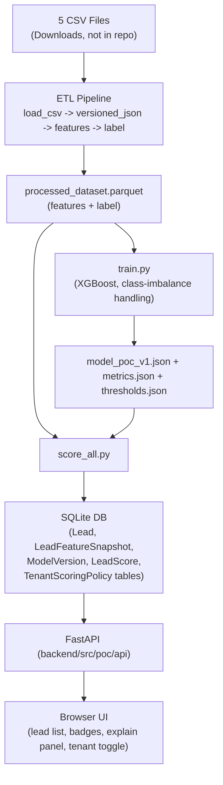

# POC Technical Design

**Reads**: `poc/data-findings.md` (what the data is), `poc/spec.md` (what to build), `poc/tasks.md` (build order).
**This doc answers**: folder structure, data flow, DB schema, feature list, encoding, explainability, and operational conventions — decided once, up front, so implementation doesn't get reorganized mid-way.

## 1. Architecture



Everything left of `db` runs offline/batch, on demand (re-run via one script). Everything right of `db` is the live-demo path — synchronous reads only, no queue/cache.

## 2. Project structure

```text
backend/
├── config/
│   └── poc.yaml                      # csv file list, db path, model dir, top tenants, threshold percentiles
├── data/poc/                         # generated, gitignored (contains PII-derived data)
│   └── processed_dataset.parquet
├── models/poc/                       # generated, gitignored
│   ├── model_poc_v1.json
│   ├── metrics.json
│   ├── thresholds.json
│   └── lead_scores.csv
└── src/
    └── poc/
        ├── config.py                 # load_poc_config() — reads config/poc.yaml, independent of the dev/prod loader
        ├── feature_spec.py           # single source of truth: canonical feature list + dtypes + encoding
        ├── etl/
        │   ├── versioned_json.py     # parse {"1": "New", "2": "Pending"} -> (current_value, transition_count)
        │   ├── load_csv.py           # read 5 CSVs, concat, dedupe by LeadId (keep latest ModifiedDate)
        │   ├── label.py              # conversion label per POC-FR-002
        │   ├── features.py           # build flat feature table from feature_spec.py
        │   └── build_dataset.py      # orchestrates the above -> processed_dataset.parquet
        ├── training/
        │   ├── train.py              # split + XGBoost fit -> model_poc_v1.json
        │   ├── evaluate.py           # AUC/precision/recall + percentile thresholds -> metrics.json, thresholds.json
        │   ├── score_all.py          # score every lead -> lead_scores.csv + writes DB rows
        │   └── explain.py            # per-lead top-3 contributions + canned next action
        ├── db/
        │   └── seed.py               # writes Lead/LeadFeatureSnapshot/ModelVersion/LeadScore/TenantScoringPolicy rows
        └── api/
            ├── app.py                # FastAPI app factory
            ├── lead_routes.py        # GET /poc/leads, GET /poc/leads/{id}/score, POST /poc/leads/{id}/explain
            └── tenant_routes.py      # PATCH /poc/tenants/{id}/scoring-policy

ui/poc/
└── index.html                        # single-page demo UI (plain HTML/JS, served as a static file by FastAPI)
```

This matches `poc/tasks.md`'s file paths (adjusted to a `db/seed.py` module for the persistence step that Phase B/C implied but didn't name explicitly).

## 3. Data flow (one input, one output per script)

```text
5 CSVs --> load_csv.py --> raw_df (deduped, 49,830 rows)
raw_df --> versioned_json.py (applied per column) --> flattened current-value columns
flattened --> features.py --> feature_df (per feature_spec.py)
flattened --> label.py --> label series (158 positives after cancellation exclusion)
feature_df + label --> build_dataset.py --> processed_dataset.parquet
processed_dataset.parquet --> train.py --> model_poc_v1.json
processed_dataset.parquet + model_poc_v1.json --> evaluate.py --> metrics.json, thresholds.json
processed_dataset.parquet + model_poc_v1.json + thresholds.json --> score_all.py --> lead_scores.csv + DB rows
DB rows --> api/app.py --> UI
```

Every script reads its input from disk/DB and writes its output to disk/DB — no shared in-memory state between phases. This means any phase can be re-run alone once its input file exists.

## 4. Configuration

`backend/config/poc.yaml`:
```yaml
csv_files:
  - "C:/Users/aksha/Downloads/data-1776891244155.csv"
  - "C:/Users/aksha/Downloads/data-1776891157362.csv"
  - "C:/Users/aksha/Downloads/data-1776891100282.csv"
  - "C:/Users/aksha/Downloads/data-1776891037923.csv"
  - "C:/Users/aksha/Downloads/data-1776713795562.csv"
data_dir: "data/poc"
model_dir: "models/poc"
database_url: "sqlite:///data/poc/poc.db"
top_tenants:
  - blissrealty
  - propmart
  - lifespacepropertysolution
  - prdblack
  - assettrustservices
hot_percentile: 0.90    # top 10% of scores -> hot
warm_percentile: 0.60   # next 30% -> warm, rest -> cold
model_version: "poc-v1"
log_level: INFO
```

An explicit file list (not a glob over `Downloads/`) avoids accidentally picking up unrelated CSVs in that folder. This file is **not** the same as `backend/config/dev.yaml`/`prod.yaml` — it's read by a small standalone `load_poc_config()` in `backend/src/poc/config.py`, so POC config concerns don't get mixed into the production `config/loader.py` (which intentionally only accepts `dev`/`prod`).

## 5. Database schema — reuse, don't duplicate

The POC does **not** create new tables. `backend/src/models/entities.py` already has everything needed:

| Pipeline output | Table | Notes |
|---|---|---|
| One row per unique lead | `Lead` | `lifecycle_state="open"` for all POC leads |
| One row per demo tenant | `TenantScoringPolicy` | `scoring_enabled=True` by default, thresholds from `thresholds.json` |
| One row for the trained model | `ModelVersion` | `model_version="poc-v1"`, `model_scope="global"`, `status="active"`, `metrics` = AUC/precision/recall from `evaluate.py` |
| One row per lead's flattened features | `LeadFeatureSnapshot` | `feature_cutoff_ts` = pipeline run timestamp (single batch cutoff for all leads, since this is a historical snapshot, not a stream), `feature_vector` = the row's feature dict, `is_leakage_validated=True` (PII already excluded in `feature_spec.py`) |
| One row per lead's score | `LeadScore` | FK's to the `LeadFeatureSnapshot` and `ModelVersion` rows above; `is_stale=False`, `staleness_seconds=0` (no freshness concept for a static batch) |

SQLite via `database_url: sqlite:///data/poc/poc.db` is sufficient — same SQLAlchemy models work against Postgres later with no code change, only a config swap.

## 6. Feature dictionary (`feature_spec.py` is the executable version of this table)

| Feature | Type | Source | Encoding |
|---|---|---|---|
| `tenant_id` | Categorical (high-cardinality) | `TenantId` | pandas `category` dtype, XGBoost native categorical |
| `current_status` | Categorical | `BaseLeadStatus` (last key) | `category` dtype |
| `status_transition_count` | Numeric | `BaseLeadStatus` (key count) | as-is |
| `current_sub_status` | Categorical | `SubLeadStatus` (last key) | `category` dtype |
| `lead_source_code` | Categorical | `LeadSource` (last key, opaque numeric code) | `category` dtype |
| `property_type` | Categorical | `BasePropertyType` (last key) | `category` dtype |
| `bhk_type` | Categorical | `BHKType` | `category` dtype |
| `no_of_bhk` | Numeric | `NoOfBHK` | as-is, missing -> -1 |
| `sale_type` | Categorical | `SaleType` (last key) | `category` dtype |
| `enquired_for` | Categorical | `EnquiredFor` (last key) | `category` dtype |
| `enquired_city` | Categorical | `EnquiredCity` (last key) | `category` dtype |
| `lower_budget` | Numeric | `LowerBudget` (last key) | as-is |
| `upper_budget` | Numeric | `UpperBudget` (last key) | as-is |
| `is_picked` | Boolean | `IsPicked` (last key) | 0/1 |
| `has_scheduled_meeting` | Boolean | `ScheduledDate` (last key present?) | 0/1 |
| `is_meeting_done` | Boolean | `IsMeetingDone` (last key) | 0/1, missing -> 0 |
| `is_site_visit_done` | Boolean | `IsSiteVisitDone` (last key) | 0/1, missing -> 0 |
| `contact_attempt_count` | Numeric | `ContactRecords` (count of entries) | as-is |
| `contact_success_count` | Numeric | `ContactRecords` (count of `1` values) | as-is |
| `days_since_created` | Numeric | `CreatedDate` vs pipeline run date | as-is |
| `days_since_modified` | Numeric | `ModifiedDate` (last key) vs pipeline run date | as-is |
| `share_count` | Numeric | `ShareCount` (last key) | as-is |

Explicitly excluded (PII, per POC-FR-010): `Name`, `Email`, `ContactNo`, `AlternateContactNo`, `ReferralContactNo`, `ReferralName`, `LandLine`, `DateOfBirth`, `ConfidentialNotes`, `Notes`.

## 7. Categorical encoding decision

**XGBoost native categorical support** (`enable_categorical=True`, pandas `category` dtype), not one-hot encoding.

Why: `tenant_id` alone has 742 distinct values in the raw export (5 used for the demo, but the model trains on the full dataset per the spec's global-model decision); `enquired_city` and `lead_source_code` are also high-cardinality. One-hot would blow up dimensionality and create sparse, mostly-unused columns for a POC. Native categorical splits handle this natively and are simpler to maintain — same approach carries forward cleanly to a production XGBoost model.

## 8. Explainability approach

**Per-row contributions via `Booster.predict(..., pred_contribs=True)`** (XGBoost's built-in TreeSHAP-equivalent output), not global feature importance.

Why: POC-FR-007 requires per-lead "top 3 contributing features," which global importance can't provide (it's the same three features for every lead, and dropped in `plan.md`'s comment that it's a fine simplification if per-lead isn't feasible — it is feasible here at negligible extra cost). Using `pred_contribs` also means the eventual switch to full SHAP (`shap_explanation_service.py` in the full `plan.md`) is a drop-in replacement, not a rewrite — both are the same underlying algorithm for tree models.

`explain.py` maps the top 3 contributing features to a plain-language `top_signals` list (e.g. `status_transition_count` -> "Lead has been actively followed up (5 status changes)") and a canned `recommended_action` keyed by `(category, top_feature)`.

## 9. Logging convention

Every script in `etl/` and `training/` uses the existing `backend/src/observability/logging.py` bootstrap and logs, at minimum, a start line, an end line, and the key count(s) that validate that stage — matching the numbers already established in `data-findings.md`:

```
INFO load_csv: loaded 5 files, 50000 raw rows
INFO load_csv: deduped to 49830 unique leads
INFO label: 158 positive labels out of 49830 (0.3171%), 4 excluded as cancelled/reverted
INFO features: built 21 features for 49830 leads, 0 PII columns present
INFO train: AUC=0.87 on holdout
INFO score_all: 49830 scores written (demo tenants: 8214 leads)
```

If a run's logged counts don't match `data-findings.md`, that's the signal something upstream broke — check that stage first.

## 10. Intermediate artifacts

All generated under `backend/data/poc/` and `backend/models/poc/`, both gitignored (real PII-adjacent data and binary model files don't belong in git):
- `processed_dataset.parquet` — features + label, output of Phase A
- `model_poc_v1.json` — trained XGBoost model
- `metrics.json` — AUC, precision/recall, category counts
- `thresholds.json` — the percentile-derived Hot/Warm/Cold cutoffs actually used
- `lead_scores.csv` — flat dump of every scored lead, for quick inspection without querying the DB

`backend/scripts/run_poc_pipeline.py` (Phase E task) runs Phase A + B end-to-end and regenerates all of the above from the 5 CSVs.

## 11. Incremental build order (validation checkpoint per step)

1. `load_csv.py` alone → assert 49,830 unique `LeadId` rows after dedupe.
2. `versioned_json.py` applied to `BookedDate`/`SoldPrice` → assert 156 non-null `BookedDate`, 71 `SoldPrice > 0` (per data-findings.md).
3. `label.py` → assert 158 positive labels (162 raw signal minus 4 cancelled/reverted).
4. `features.py` → assert the feature table has no PII columns and no nulls in required numeric columns.
5. `train.py` + `evaluate.py` → record AUC; sanity check it's meaningfully above 0.5 given the rare-positive-class setup.
6. `score_all.py` → assert one score row per lead in the demo tenant set, category counts roughly matching the configured percentiles.
7. API endpoints → manual check against the seeded DB.
8. UI → click-through.

Each step's exit check must pass before starting the next — this is the same discipline `tasks.md`'s Phase 2→3 handoff checklist already established for the full spec.
